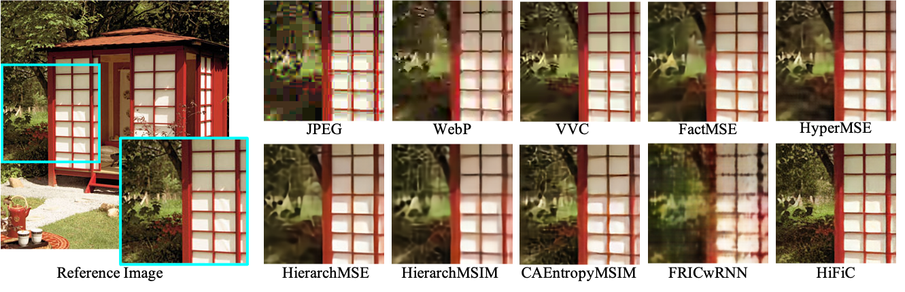

# Quality Assessment of End-to-End Learned Image Compression: The Benchmark and Objective Measure


## Description
Database and IQA code for the following paper:
- Yang Li, Shiqi Wang, Xinfeng Zhang, Shanshe Wang, Siwei Ma, and Yue Wang. 2021. Quality Assessment of End-to-End Learned Image Compression:
The Benchmark and Objective Measure. In Proceedings of the 29th ACM International Conference on Multimedia (MM ’21), October 20–24, 2021, 
Virtual Event, China. ACM, New York, NY, USA, 9 pages. https://doi.org/10.1145/3474085.3475569
  
## Dataset
Download link 
* *[Baidu Drive](https://pan.baidu.com/s/1hc8DA62AHouEHlpMMch_Yw)* Extraction code: am21
* *[Google Drive](https://drive.google.com/file/d/1RpwqOE6J-dNa6Hun9wxG7dJEqXiLvtlM/view?usp=sharing)*


Newly built image compression dataset, with the consideration of different traditional image codecs
(i.e. JPEG, WebP and VVC), as well as learning-based image codecs introduced in
following papers:

FRICwRNN, HyperMSE, FactMSE, HierarchMSE, HierarchMSIM, CAEntropyMSIM, HiFiC
* George Toderici, Damien Vincent, Nick Johnston, Sung Jin Hwang, David Minnen, Joel Shor, Michele Covell: Full Resolution Image Compression with Recurrent Neural Networks. CVPR 2017: 5435-5443
* Johannes Ballé, David Minnen, Saurabh Singh, Sung Jin Hwang, Nick Johnston: Variational image compression with a scale hyperprior. ICLR (Poster) 2018
* David Minnen, Johannes Ballé, George Toderici: Joint Autoregressive and Hierarchical Priors for Learned Image Compression. NeurIPS 2018: 10794-10803
* J. Lee, S. Cho, and S.-K. Beack, “Context adaptive entropy model for end-to-end optimized image compression,” arXiv preprint arXiv:1809.10452, 2018.
* Fabian Mentzer, George Toderici, Michael Tschannen, Eirikur Agustsson: High-Fidelity Generative Image Compression. CoRR abs/2006.09965 (2020)

## IQA model


### Dependencies
* Python 3.7
* PyTorch >= 1.7.0
* numpy
* matplotlib
* scipy
* Pillow
* einops

### Networks
Different networks are contained in ``/network``

DISTS ``/network/dists.py``, from https://github.com/dingkeyan93/DISTS
* Keyan Ding, Kede Ma, Shiqi Wang, and Eero P Simoncelli. 2020. Image Quality Assessment: Unifying Structure and Texture Similarity. 
  IEEE Transactions on Pattern Analysis and Machine Intelligence (2020).
  
WaDIQaM ``/network/wadiqam.py``, from https://github.com/lidq92/WaDIQaM
* Sebastian Bosse, Dominique Maniry, Klaus-Robert Müller, Thomas Wiegand, and Wojciech Samek. 2017. Deep neural networks for no-reference and full-reference image quality assessment. 
  IEEE Transactions on image processing 27, 1 (2017), 206–219.
  
LICQA ``/network/vit.py``, our model

### How to train the IQA model
Start training by setting all options listed in ``params.py`` and run ``main.py``, 
or simply using provided demos in the ``run.sh``.

```bash
cd LICQA       # You are now in */LICQA/
sh demo.sh
```

## Update log
* Sept 25, 2021
  * Initialize the project.
